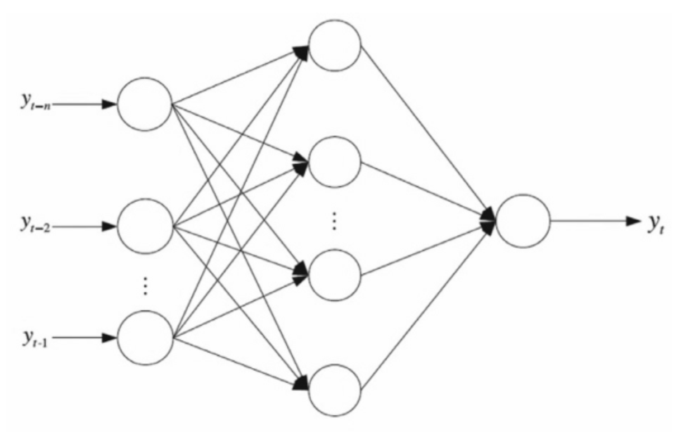
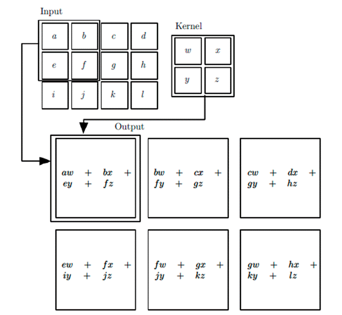
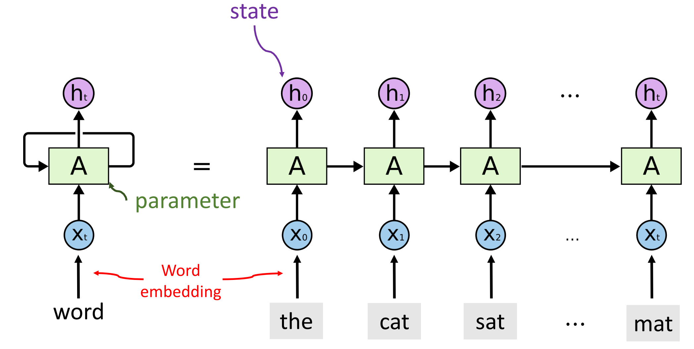
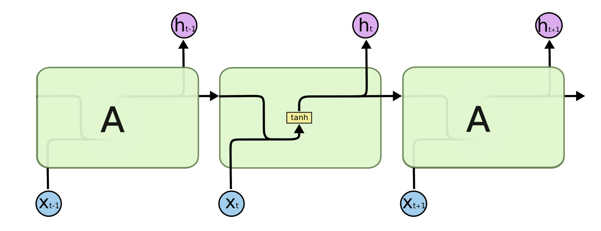
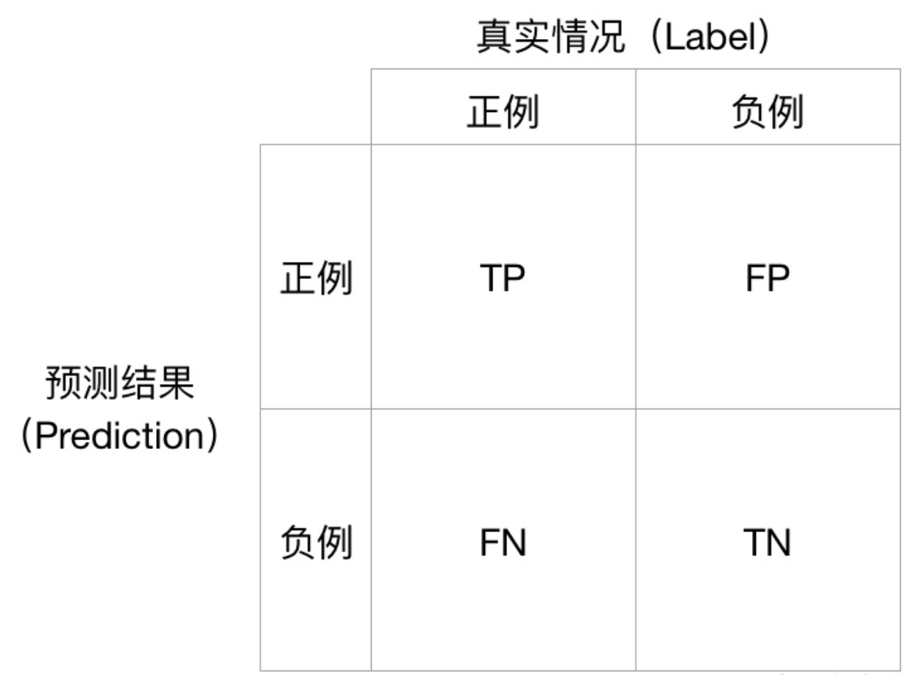
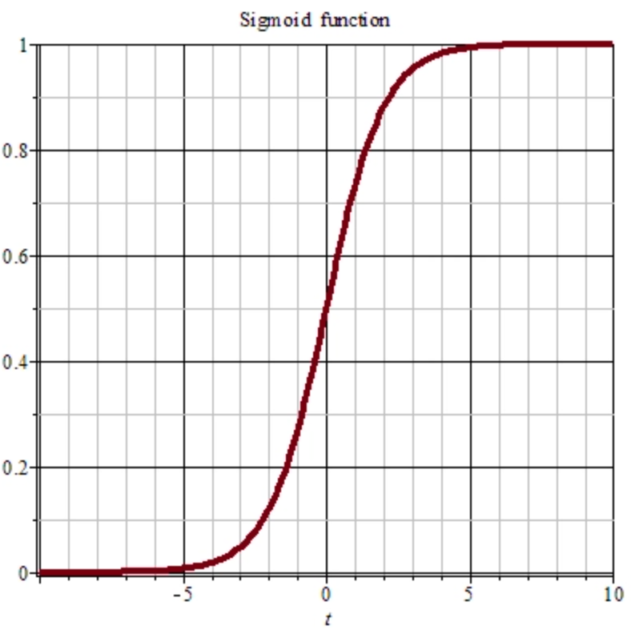
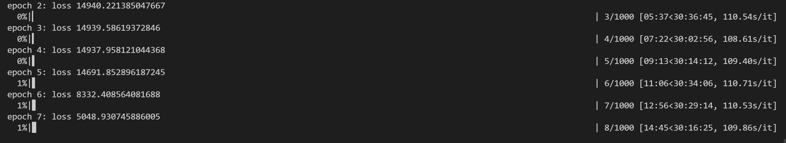
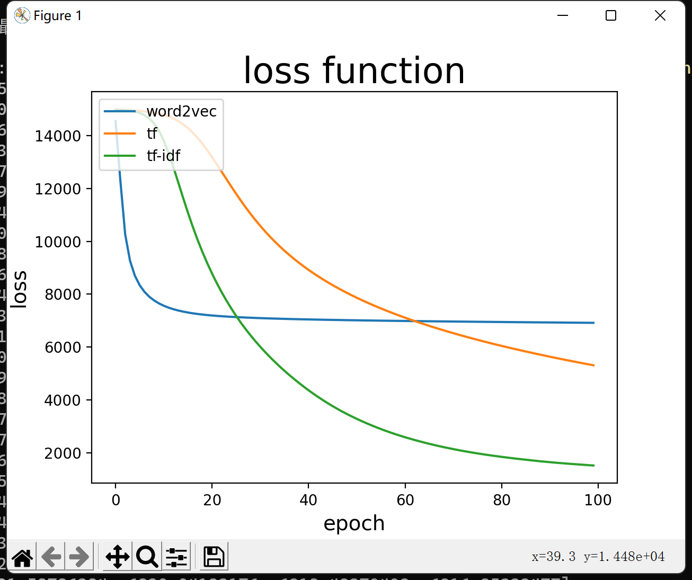

<center><font size = 7>自然语言处理


<center><font size = 6> Midtern-Project

<center><font size = 6> IMDB电影评论文本分类


> 第一次写神经网络，确实写的不怎么好


## 实验环境

**操作系统**：Windows 11

CPU：AMD RYZEN7 5800H

Python：Python 3.8.6


##  理论部分

​		这部分将会简单地解释用到的理论知识，在实验部分会有详细地分析。

### 词特征

#### TF

​		TF 的全称是 Term Frequency，即词频。词频的计算方式为某个词在一篇影评中的出现次数。考虑到影评的长度有长有短，为了便于不同的文章之间进行比较，需要对词频进行标准化，即
$$
词频=\frac{某个词在一段影评中出现的次数}{这段影评的总词数}
$$
​		用词频来对影评进行二分类的优点是计算比较方便，而缺点也很明显：用词频来衡量影评中一个词语的情感其实不够全面，有时候能够体现情感的词语出现的次数可能会很少，而且这种计算无法体现词语在影评中出现的位置信息，无法体现词语在上下文中的结构。

#### TF-IDF

​		TF-IDF 是 TF 的一种改良版本，在 TF 的基础上，增加了 IDF 这项特征。IDF 的全称是 Inverse Document Frequency，即逆文档频率。其计算方法为：
$$
逆文档频率=log(\frac{影评数量}{包含该词语的影评数+1})
$$
可以发现，如果一个词语越常见，那么分母就越大，逆文档频率就会越小。分母加一的原因是避免分母为 0。

​		之所以需要计算 IDF，考虑这样一个场景。假如“好看”和“胖乎乎”出现的次数一样多，是不是意味着这三个词语的情感特征是一样的。其实不然，事实上“好看”这个词语在其他影评中比较常见，而“胖乎乎”只在某几篇影评中出现，那么“好看”这个词语的特征显然和“胖乎乎”有着天壤之别。

​		计算 TF-IDF 的方法为：
$$
TF-IDF=TF\times IDF
$$
TF-IDF 与一个词在影评中的出现次数成正比，与该词在整个影评集合中的出现次数成反比。事实上 TF-IDF 更适合用来进行关键词提取。当然，也不是说其作为情感分析的特征不合理。

#### word2vec

​		word2vec 即词向量，是用来将语言中的词语进行数学化的一种方式。顾名思义，词向量就是把一个词语表示成为一个向量。有两种比较常见的转换方法：**One-Hot** 和 **Distributed Representation**。

​		One-Hot 方法比较简单，就是用一个很长的向量来表示一个词，向量的长度为词典的大小，向量中只有一个 1 ， 其他全为 0 ，1 的位置对应该词在词典中的位置。这种表示方式如果用稀疏矩阵的方式存储的话，会比较简洁。简单来说，就是对每个词语分配一个 ID，那么用一个 Hash 表即可存储所有的向量。但是 One-Hot 方法的缺点也很明显：

1. 当词汇量特别大的时候，很容易发生维度灾难。One-Hot 方法中向量的长度为词典的大小，当词语的数量达到千万级别的时候，词向量的大小变成了一千万维，不要说是计算了，光是存储内存都已经接受不了了。
2. 不能很好的刻画词与词之间的相似性。采用 One-Hot 方法，任意两个词语之间都是鼓励的，从两个向量中看不出来词语之间的任何关系。这样对于语言处理来说，是不利的。

​		Distributed Representation 方法可以客服上述的确定。通过训练将某种语言中的每一个词映射成一个固定长度的向量，所有这些向量构成一个词向量空间，而每一个向量则可视为 该空间中的一个点，在这个空间上引入“距离”，就可以根据词之间的距离来判断它们之间的语法、语义上的相似性了。在实验中，word2vec 特征采用的就是这个方法。

### 分类方法

#### 前馈神经网络

​		前馈神经网络，也叫做反向传播网络，是最基础的神经网络，其输出结果采用前向传播，误差采用反向传播方式进行。

​		BPNN模型的一般结构如下图所示，它由输入层、隐层和输出层三层组成，其中隐层在输入层和输出层之间传递着重要的信息。



​		简单来说，就是对于输入的向量，通过一个矩阵运算和激活函数得到隐藏层的矩阵，再通过一次矩阵运算和激活函数可以得到输出向量。接着通过计算输出向量和标签之间的误差，反向求导，更新计算的矩阵。

​		网络中具体的计算和证明比较复杂，就不在报告中阐述了。后续在实验代码分析的时候，会做简要地分析。

#### 卷积神经网络

​		卷积神经网络的工作模式如下：



​		将卷积核看作一个滑动的窗口，从输入层（即图像）的左上角开始滑动。上图中，卷积核可以覆盖 2\*2 的区域。现在，以卷积核所处在的第一个位置为例，即图像的左上角。此时，卷积核中的值会与图像中的原始像素值做点乘运算，得到一个 2\*2 的乘积矩阵，将矩阵中所有元素的值相加，即可得到第一个运算结果，即图中的 aw+bx+ey+fz ，为图像在该位置卷积运算后的结果。在输入内容上的每一位置重复该过程（下一步将是将卷积核右移 1 单元，接着再右移 1 单元，以此类推）。图像上的每一个特定位置都会产生一个数字，卷积核滑过所有位置后将得到一个2*3的矩阵。该矩阵即是卷积层一次运算后的结果。

#### 循环神经网络

​		首先看一个简单的循环神经网络如，它由输入层、一个隐藏层和一个输出层组成：



​		我们现在这样来理解，如果把上面有W的那个带箭头的圈去掉，它就变成了最普通的**全连接神经网络**。x是一个向量，它表示**输入层**的值（这里面没有画出来表示神经元节点的圆圈）；s是一个向量，它表示**隐藏层**的值（这里隐藏层面画了一个节点，你也可以想象这一层其实是多个节点，节点数与向量s的维度相同）；

​		U是输入层到隐藏层的**权重矩阵**，o也是一个向量，它表示**输出层**的值；V是隐藏层到输出层的**权重矩阵**。

​		那么，现在我们来看看W是什么。**循环神经网络**的**隐藏层**的值s不仅仅取决于当前这次的输入x，还取决于上一次**隐藏层**的值s。**权重矩阵** W就是**隐藏层**上一次的值作为这一次的输入的权重。

​		我们给出这个抽象图对应的具体图：



​		我们从上图就能够很清楚的看到，上一时刻的隐藏层是如何影响当前时刻的隐藏层的。

### 验证指标

#### Accuracy

​		Accuracy 是准确率，其计算公式为：
$$
\operatorname{Accuracy}(f ; \mathcal{D})=\frac{1}{n} \sum_{i=1}^{n}\left(f\left(\boldsymbol{x}_{i}\right)=l a b e l_{i}\right)
$$
简单来说，就是预测的正确率。

#### Precision and Recall

​		Accuracy 虽然常用，但是无法满足所有分类任务需求。有这么一个例子：

> 这个任务的特点是正例负例分布非常不平均，因为恐怖分子的数量远远小于非恐怖分子的数量。假设一个数据集中的恐怖分子的数量与非恐怖分子的数量比例为1:999999999，我们引入一个二分类判别模型，它的行为是将所有样例都识别为负例（非恐怖分子），那么在这个数据集上该模型的Accuracy高达99.9999999%，但恐怕没有任何一家航空公司会为这个模型买单，因为它永远不会识别出恐怖分子，航空公司更关注有多少恐怖分子被识别了出来。

​		虽然这在电影影评分类中体现得并不明显，但是也是一个有用的指标。由此我们引入**Precision（精准度）**和**Recall（召回率）**，它们**仅适用于二分类问题**。对于一个二分类问题，有四种情况：



​		Precision 的定义为：
$$
\text { Precision } \triangleq \frac{T P}{T P+F P}
$$
​		Recall 的定义为：
$$
\text { Recall } \triangleq \frac{T P}{T P+F N}
$$
​		Precision从预测结果角度出发，描述了二分类器预测出来的正例结果中有多少是真实正例，即该二分类器预测的正例有多少是准确的；Recall从真实结果角度出发，描述了测试集中的真实正例有多少被二分类器挑选了出来，即真实的正例有多少被该二分类器召回。

#### f1score

​		Precision 和 Recall 是一对矛盾的度量，一般来说，Precision 高时，Recall 值往往偏低；而 Precision 值低时，Recall 值往往偏高。当分类置信度高时，Precision 偏高；分类置信度低时，Recall 偏高。为了能够综合考虑这两个指标，需要计算 Precision 和 Recall 的加权调和平均，即：
$$
F_{1}=2 \times \frac{P \times R}{P+R}
$$

## 实验方法、步骤与具体细节

​		在完成报告后，又对代码进行了一点调整，但无伤大雅。以下分析仅作技术讨论，具体代码可能存在细微出入。

### 文本预处理

​		实验给定了一个 csv 文件，里面包含了 50000 条影评。第一步是要读取这个 csv 文件：

```python
dataset = load_dataset("test")
```

​		数据集的第一行是属性，这一行可以不加载到数据集当中。csv 文件有两列，第一列是影评，第二列是这条影评的情感（positive 或者 negative）。

```python
def load_dataset(name):
    '''加载数据集'''
    f = open('IMDB Dataset.csv', 'r', encoding='utf-8')
    dataset = []
    with f:
        reader = csv.reader(f, delimiter=",")
        print("Loading dateset...", end = '\n')
        for row in tqdm(reader):
            if row[0] == 'review':
                continue
            text = clear(row[0])
            label = row[1]
            dataset.append([text, label])
    return dataset
```

​		在加载数据集的时候，需要对文本做清洗：

```python
def clear(dict, features):
    '''文本清洗'''
    dict = dict.replace("<br />", " ").lower()
    dict = dict.split(' ')
    dict = delete_stopword(dict)
    dict = clear_character(dict)
    if features == 'word2vec':
        return dict
    else:
        porter_stemmer = PorterStemmer()
        new_dict = [porter_stemmer.stem(i) for i in dict]
        return new_dict
```

文本显然是从某个网站上爬下来的，经过测试，文本中所有的唯一的 html 标记是"\<br />"，首先将其清洗掉（变成空格），避免影响后续操作。然后要去除停用词，这里的处理顺序很重要，因为停用词当中有着一些诸如 “aren't” 的词语接着采用正则表达式的方式,只保留中英文、数字和空格，去掉其他东西。

​		还有一个问题，就是**时态**的问题。对于一个词语，在不同的时态下，对于计算机呈现的是不同的单词。这样就会造成一个问题，因为不同时态的词语其实表达的是一个意思，然而这些不同时态的词语会形成很多词语，这样会使得整个词典无谓地变大。因此，对于不同的词语统一时态是一个很好的选择。既然都这样做了，事实上对于一个词语，我们只需要将其词根提取出来即可。有一个问题就是，word2vec的词表是不需要提取词干的，因为预训练模型中的词表中对于同一词干的词语也是有不同形态的。

```python
def clear_character(dict):
    '''只保留中英文、数字和空格，去掉其他东西'''
    pattern = re.compile("[^a-z^ ]")
    new_dict = []
    for i in dict:
        i = re.sub(pattern, '', i)
        new_dict.append(i)
    return new_dict
```

​		得到 dataset 后，需要将 dataset 分解成为文本信息 text 和情感标签 label：

```python
text, label = split_dataset(dataset)
```

​		其操作很简单，就是简单的分割：

```python
def split_dataset(dataset):
    text = []
    label = []
    for i in dataset:
        text.append(i[0])
        label.append(i[1])
    return text, label
```

​		数据集需要被分成三个部分：训练集、测试集和验证集。训练集用于训练网络，而网络中有一些超参数，需要通过测试集进行调整。测试集还有另外一个作用，就是可以判断训练是否可以提前停止，防止过拟合。而验证集用于验证，之所以将三者分开，是为了避免在验证集上验证，对实验结果产生影响。

```python
train_text, train_label = split_dataset(dataset[ : n_train])
test_text, test_label = split_dataset(dataset[n_train : n_train + n_test])
value_text, value_label = split_dataset(dataset[n_train + n_test : ])
```

​		得到的文本数据需要进行清洗和过滤：

```python
filter_word, all_word = filter_list(text)
```

filter_word 是被过滤掉的低频词和停用词，all_word 是剩余的词典。

​		低频词需要被过滤掉。之所以低频词需要处理，很大程度上一个原因是有些低频词对文本基本是没有贡献。而这类词语的数量比较多，过滤掉可以减小词典的大小，降低计算的复杂度。低频词的选择有一些考究，具体筛选的频率可以动态调整，但不会对训练结果产生太大的影响。在此选择将出现次数小于 10 的词语筛选掉。至于停用词，我采用的高频词的方式，具体原因在下文。

```python
def filter_list(list_words):
    # 总词频统计
    doc_frequency = defaultdict(int)
    for word_list in list_words:
        for i in word_list:
            doc_frequency[i] += 1
    
    filter_word = []
    all_word = []
    low_frequency = 10
    high_frequency = 3000
    print("Begin to calc the word frequency : ", end = '\n')
    for i in tqdm(doc_frequency):
        if doc_frequency[i] < low_frequency or doc_frequency[i] > high_frequency:
            filter_word.append(i)
        elif i not in all_word:
            all_word.append(i)
    
    return set(filter_word), set(all_word)
```

我们考虑什么是**停用词**：在自然语言处理中，无用的单词称为停用词。停用词是指搜索引擎已编程忽略的常用词（例如 “the”， “a”， “an”， “in”）。我们不希望这些单词占用我们数据库中的空间，或占用宝贵的处理时间。为此，我们可以通过存储要停止使用的单词的列表轻松删除它们。python中的 NLTK（自然语言工具包）具有以 16 种不同语言存储的停用词列表。但是，在具体实验的时候，想到了一个问题：英文的停用词里面有 not 和一些别的否定词。将一些否定词移除之后就可能变为肯定句。这样是不是不可以移除呢？比如：The movie is not good. 移除停用词之后就变成了：The movie is good. 这样合理嘛？还是说要根据特定的任务自己选择停用词呢？有这样一种说法：自己构造停用词表完全是可以的，根据自己的应用场景去构造停用词显然会提高本场景下的结果效果，相应的对本场景的依赖就会变强，泛化性降低，反之就是本场景的效果提不上去。这就看你的需求了，是做一个普适的，还是本应用最优的。能找到的停用词表，也不见得就是合适的，还得自己根据内容，来源和对自己场景的契合程度去评估或者调整一下再用到自己的环境。因此，我采用了出现次数大于 3000 词的词语为停用词。

​		接着是**大小写**的问题，一开始我认为，不需要统一转换成大写或者小写，因为在一篇正常地由小写字母组成的文章中，大写字母表达了一种强烈的情感。比如一篇文章中：

```
I am very HAPPY!!!!!!
```

这句话中，HAPPY 的大写突出了这句话强烈的情感。

​		但是我转念一想，由于我们处理的时候需要处理掉一些低频的词语，而一篇文章中，happy 可能会出现很多次，但是 HAPPY 很可能会被认作是低频词语给筛除掉。而且，众所周知，一句话的开头的单词首字母是需要大写的，这种词语也很可能会被认作是低频词语给筛除掉。因此，在进行处理前，还是需要将所有字母转换成小写字母。

​		接着需要给词典中的每个词语一个编号，这样做的目的是为了方便后续的数组操作。

```python
id = getid(all_word)
```

其具体实现是给每个单词一个索引：

```python
def getid(all_word):
    id = defaultdict(int)
    cnt = 0
    for i in all_word:
        id[i] = cnt
        cnt += 1
    return id
```

### TF、TF-IDF

​		接下来是获取 TF-IDF 特征：

```python
word_features = tfidf.get_tfidf(all_word, id, train_text, features)
```

这部分的框架如下：

```python
def get_tfidf(all_word, id, list_words, feature):
    # 计算 TF
    # 计算每个词的 IDF 值
    # 两者相乘得到 TF-IDF
```

​		首先是计算 TF 的部分：

```python
word_tf = []
print("\n\nBegin to calc the tf: ", end = '\n')
for word_list in tqdm(list_words):
    one_frequency = defaultdict(int)
    for i in word_list:
        if i in all_word:
            one_frequency[i] += 1
    one_tf = {}
    for i in one_frequency:
        one_tf[i] = one_frequency[i] / sum(one_frequency.values())
    word_tf.append(one_tf)
```

TF 值是对于每条影评而言的，计算的是每条影评中的单词在该影评当中的 TF 值。one_frequency 计算的是该单词的频率，计算得到 one_tf 为该影评中的 TF 值。这里有一个小小的伏笔，all_word 是一个 set，采用 set 会比采用 list 计算快大概 300 倍。

​		IDF 计算的是每个词语在所有影评中出现过的影评数量：

```python
# 计算每个词的 IDF 值
doc_num = len(list_words)
word_idf = {} # 存储每个词的 idf 值
word_doc = defaultdict(int) # 存储包含该词的文档数
print("\n\nBegin to calc the idf : ", end = '\n')
for i in tqdm(list_words):
    i = set(i)
    for word in i:
        if word in all_word:
            word_doc[word] += 1
for i in all_word:
    word_idf[i] = math.log(doc_num / (word_doc[i] + 1))
```

显然的一种做法就是便利词典，对于每个单词都扫描一遍所有的影评。

​		最后，两者相乘得到 TF-IDF 特征。这里使用到了上述得到的词典的索引，这样做的另外一个目的就是为了固定网络输入层的结构。

```python
print("\n\nBegin to calc the tf-idf : ", end = '\n')
tfidf_list = np.zeros((doc_num, len(all_word)))
for i in tqdm(range(doc_num)):
    word_list= set(list_words[i])
    for word in set(word_tf[i]):
        tfidf_list[i][id[word]] = word_tf[i][word] * word_idf[word]
return tfidf_list
```

结构是和 TF 一致的，不同之处一是每个值都乘上了 IDF，另一个地方是利用索引重新排好序。如果影评中不存在某个单词，那么其值记为0。

​		当然，如果只需要 TF 特征的话，直接进行索引排序即可：

```python
doc_num = len(list_words)
tf_list = np.zeros((doc_num, len(all_word)))
for i in trange(doc_num):
    for word in set(word_tf[i]):
        tf_list[i][id[word]] = word_tf[i][word]
return tf_list
```

同样的，如果影评中不存在某个单词，那么其值记为0。

​		当然，也采取了预处理的形式，可以直接加载已经处理好的特征：

```python
if os.path.exists(".\\Checkpoint\\" + features + "_feature.npy"):
    print("\n\nLoading " + features + "...", end = '\n')
    word_features = np.load(".\\Checkpoint\\" + features + "_feature.npy")
```

### word2vec

​		而 word2vec 特征则是比较容易可以获取。由于计算的复杂性，该特征采用加载预训练模型的方式：

```python
dim, data = word2vec.load("wiki-news-300d-1M.vec")
```

该模型采用的是 1 million word vectors trained on Wikipedia 2017, UMBC webbase corpus and statmt.org news dataset (16B tokens)。具体链接在附录。

​		预训练模型的形式为，第一行是两个值，分别表示单词的数量和向量的维度。接下来每一行，第一个位置是单词，接下来是一个相应维度的向量。因此先读取第一行，提取出数量和维度信息，然后对后面的每一行以空格作为分隔符进行加载数据集。

```python
def load(path):
    print("\n\nLoading...", end = '\n')
    f = io.open(path, 'r', encoding = 'utf-8', newline = '\n')
    n_word, dim = map(int, f.readline().split())
    print(f"{n_word} in Vector and the dim is {dim}.", end = '\n')
    word2vec = {}
    for line in tqdm(f):
        part = line.rstrip().split(' ')
        word2vec[part[0]] = np.array(list(map(float, part[1:])))
    return int(dim), word2vec
```

​		加载预训练的数据集会有一个问题，该数据集的词典和影评分类的词典是不对应的。有很多单词在预训练模型中出现过，但是在影评中其实并未出现，但这些其实不重要，他们不会影响训练的结果。关键在于有一些在影评中出现过的单词，在word2vec模型中并未出现。为此，我统计了一下数量：

```python
word_notin = word2vec.calc_word_notin(all_word, data)
cnt_notin = len(word_notin)
```

word_notin 是未出现的词表，cnt_notin 则是数量。具体操作也很简单，就是单纯地扫描两个词表：

```python
def calc_word_notin(all_word, word2vec):
    all_word = set(all_word)
    word_notin = []
    for word in all_word:
        if word not in word2vec:
            word_notin.append(word)
    # print(word_notin)
    return word_notin
```

其中 all_word 是影评的词表，word2vec 是模型的词表。

​		经过测试，不在影评的词表中的单词数量并不是很多，计算的时候忽略掉这些单词，虽然会有影响，但对整体的结果不会产生太大的影响。因此，计算的时候不计算这部分词语。

​		接着考虑 word2vec 特征如何作为输入层。我的考虑是，对于每篇文章，输入一个长度为 dim 维度的向量，每一个维度对应着词向量的维度，其值是影评中出现的单词在该维度的平均值。

```python
word_features = word2vec.get_word2vec(train_text, dim, data, word_notin, all_word)
```

这样考虑出于一个目的，这样使得输入层对于每篇文章依然是一个向量，而不是一个矩阵。原因很简单，矩阵求导极为复杂，而且我不太懂。而压缩成向量，经过测试，预测的正确率依然有保障。

其计算方式为，遍历影评中的所有词语，求和得到某一个维度的权值和，取平均即可得到该维度的值。

```python
def get_word2vec(list_words, dim, word2vec, word_notin, all_word):
    word2vec_list = np.zeros((len(list_words), dim))
    word_notin = set(word_notin)
    print("\n\nGet word2vec feature...", end = '\n')
    for j in trange(len(list_words)):
        word_list = [i for i in list_words[j] if i in all_word and i not in word_notin]
        for i in range(dim):
            value = 0.0
            for word in word_list:
                value += word2vec[word][i]
            value /= len(word_list) + 1
            word2vec_list[j][i] = value
    return word2vec_list
```

### 网络部分

​		得到数据后，可以输入当网络当中进行训练。首先加载网络的模型：

```python
if features == "tf-idf" or features == "tf":
    model = fbnn.BPNeuralNetwork(len(all_word), hidden_n, features)
elif features == 'word2vec':
    model = fbnn.BPNeuralNetwork(dim, hidden_n, features)
```

三种方法在输入层的维度是不一样的。在此，我们将 TF-IDF 与 TF 归为一类。TF-IDF 与 TF 输入的维度是词典的大小，而 wrod2vec 的输入层维度是向量的维度。初始化的具体过程如下：

```python
def __init__(self, input_n, hidden_n, name):
    np.random.seed(1)
    self.input_n = input_n + 1
    self.hidden_n = hidden_n
    self.name = name
    self.input_weight = 2 * np.random.rand(self.input_n, self.hidden_n) - 1
    self.output_weight = 2 * np.random.rand(self.hidden_n, 1) - 1
    self.learn = 0.1
    if os.path.exists(".\\Checkpoint\\" + self.name + "-input_weight.npy"):
        print("\n\nLoading model...", end = '\n')
        self.load()
    else:
        print("\n\nDon't exist model!", end = '\n')
```

其中，input_n 是输入层的维度，之所以需要加一，是因为在输入层中需要添加一个偏置项。hidden_n 是隐藏层的维度。name 是模型的名称。input_weight、output_weight 是两个中间的计算矩阵，前者是输入层到隐藏层的计算矩阵，后者是隐藏层到输出层的计算矩阵，如果存在预训练模型，则直接加载，否则对这两个矩阵随机初始化。learn 是学习率。输入层的向量维度是 1 x input_n，隐藏层的维度是 1 x hidden_n，输出层的维度是 1，因此可以推算出两个权重矩阵的维度。

​		考虑权值矩阵的初始化过程，为什么需要$2\times rand()-1$呢？这样使得矩阵中的值的值域位于 [-1, 1]。由于输入层的向量的值都是正数，如果权值矩阵的值也为正数，那么经过激活函数后的结果恒大于 0.5，因此预测结果恒为 negative。这样是不行的，需要引入一些负数。

​		加载完模型后，将[positive, negative]标签转换成二值标签。

```python
train_label_num = np.array([0 if train_label[i] == 'positive' else 1 for i in range(len(train_label))], dtype = np.float32)
```

将 psoitive 记为 0，将 negative 记为 1。

​		然后就可以开始训练。

```python
model.train(word_features, train_label_num, epochs)
```

其中 epochs 是迭代的轮数，word_features 是输入层的特征，train_label_num 是标签。对于输入层，TF-IDF 与 TF 采用的形式的一篇影评一篇影评地传入，每篇影评是一个长度为整个词典大小的向量，值是影评中对应单词的 TF-IDF / TF 值，如果不存在该单词，则该维度的值记为 0。而 word2vec 的输入层则为，对于每篇文章，输入一个长度为 dim 维度的向量，每一个维度对应着词向量的维度，其值是影评中出现的单词在该维度的平均值。

​		训练的结构其实很简单：

```python
def train(self, train_inputs, train_outputs, epochs = 10000):
    train_iterations = len(train_inputs)
    for epoch in trange(epochs):
        for iteration in range(train_iterations):
            预测结果
            反向更新output_weight
            反向更新input_weight
            计算尾插
   保存模型
```

​		由于输出层是一个单独的值，**预测结果**即为输入一条影评的向量，得到一个范围在 [0, 1] 的数。

```python
output = self.predict(train_inputs[iteration])
```

其计算方式为给定输入层，通过隐藏层和输出层的计算，得到一个值：

```python
def predict(self, inputs):
    self.input_cell = np.zeros(self.input_n)
    self.input_cell[ : self.input_n - 1] = inputs
    self.input_cell[self.input_n - 1] = 1
    self.hidden_cell = np.array([self.sigmoid(np.dot(self.input_cell, self.input_weight[: , j])) for j in range(self.hidden_n)])
    self.output_cell = self.sigmoid(np.dot(self.hidden_cell, self.output_weight[: , 0]))
    return self.output_cell
```

首先添加一个偏置项 1，然后输入层与 input_weight 输入层权重矩阵进行矩阵乘法，得到的结果通过一个激活函数得到隐藏层。激活函数采用 sigmoid 函数。



其对于任意输入，可以压缩到 [0, 1] 之间，这样符合我们的二值预测。那么对于结果值，四舍五入后即使我们的预测结果。

```python
def sigmoid(self, x):
    return 1 / (1 + np.exp(-x))
```

同时还需要其导数

```python
def sigmoid_derivative(self, x):
    return x * (1 - x)
```

​		那么，得到一个计算结果，计算其与标签之间的误差

```python
output_error = train_outputs[iteration] - output
```

根据这个误差，反向更新输出权重矩阵：

```python
output_delta = output_error * self.sigmoid_derivative(output)
output_adjustments = np.dot(self.hidden_cell.reshape(self.hidden_n, 1), output_delta)
self.output_weight += self.learn * output_adjustments
```

其计算方式是通过计算 sigmoid 函数的导数，反向传播。注意矩形的形状变化啊，使其满足矩阵乘法的运算规则。其中，更新矩阵的时候要乘上一个学习率，这个学习率通常小于 1，在此取 0.1，目的是避免一次更新太多，越过了局部最优解。

​		同样的，input_weight 输入层的权重矩阵也需要更新。方法是一样的，不同点在于计算矩阵的维度需要注意。

```python
hidden_error = np.array([np.dot(output_delta, self.output_weight[i]) for i in range(self.hidden_n)])
hidden_delta = np.array([self.sigmoid_derivative(self.hidden_cell[i]) * hidden_error[i] for i in range(self.hidden_n)])
hidden_adjustments = np.dot(self.input_cell.reshape(self.input_n, 1), hidden_delta.reshape(1, self.hidden_n))
self.input_weight += self.learn * hidden_adjustments
```

​		最后要更新计算的误差 error，这个 error 即为 loss。其计算方式为标签减去当前的预测值的累加和。

```python
error += abs(train_outputs[iteration] - output)
```

### 评估

​		由于该部分网络中没有超参数，也没有实现**早停**。出于训练的公平性，没有使用测试集，直接在验证集上进行验证。具体过程和上面的操作是一样的，首先将标签转换成二值标签，然后得到验证集的输入层数据，最后通过网络得到验证结果。

```python
value_label_num = np.array([0 if value_label[i] == 'positive' else 1 for i in range(len(value_label))], dtype = np.float32)
if features == "tf-idf" or features == "tf":
    value_tfidf = tfidf.get_tfidf(all_word, id, value_text, features)
    model.value(value_tfidf, value_label_num)
elif features == 'word2vec':
    value_word2vec = word2vec.get_word2vec(value_text, dim, data, word_notin, all_word)
    model.value(value_word2vec, value_label_num)
```

​		在评估的时候有四个指标

```python
def value(self, value_text, value_label):
    num = len(value_label)
    tp, fp, fn, tn = 0, 0, 0, 0
    print("\n\nBegin to value...", end = '\n')
    for i in trange(num):
        output = round(self.predict(value_text[i]))
        if output == 0 and value_label[i] == 0:
            tp += 1
        if output == 1 and value_label[i] == 0:
            fn += 1
        if output == 0 and value_label[i] == 1:
            fp += 1
        if output == 1 and value_label[i] == 1:
            tn += 1
    accuracy = (tp + tn) / num
    precision = tp / (tp + fp)
    recall = tp / (tp + fn)
    f1score = 2 * (precision * recall) / (precision + recall)
    print(f"Accuracy : {accuracy}; Precision : {precision}; Recall : {recall}; F1score : {f1score}", end = '\n')
```

根据四个指标的定义，依次计算四个指标。

​		**当然有一个很尴尬的问题就是，我保存的预训练模型，好像再次加载的时候，loss 又会变回最初的样子。建议可以再次训练 100 个 epochs，这样可以得到下面的实验结果。这也是我最后才发现的，虽然我不能理解为什么（不排除有一种可能，是我保留了错误的checkpoint，因为work2vec 的预训练模型是稍微正常一点的）。**

## 实验结果与分析

### 一些分析

#### 过滤结果

​		在没有处理时态问题的情况下，在过滤后，过滤了 137795 个词语，留下了大小为 29085 的词典。

```
filter word : 137795 ; useful word : 29085
```

​		而将词语的词干提取出来后：

```
filter word : 134432 ; useful word : 28087
```

#### word2vec 模型信息

模型的单词数量和向量维度

```
999994 in Vector and the dim is 300.
```

不在影评的词表中的单词数量

```python
3554 words not in.
```

#### set 和 list 的比较

这是采用 list 计算 tf 的时间：

```
[01:24<1:16:21,  6.23it/s] 
```

而改用 set 后：

```
[00:04<00:00, 2017.28it/s]
```

### 训练过程与结果

​		TF 的训练过程如下，可以看到训练时间是很稳定的，而且 loss 会逐渐收敛。



​		word2vec 的计算时间最快，因为其向量维度只有 300 维，只需要 3s 即可完成一个 epoch；而 tf 和 tf-idf 由于向量维度比较大，需要大概 1min 左右训练完成一个 epoch。

​		由于时间关系，只训练了 100 个 epoch，其实还没有收敛。初步得到的损失函数如下：



三者的指标如下：

|          | Accuracy | Precision | Recall | F1score |
| -------- | -------- | --------- | ------ | ------- |
| TF       | 0.7997   | 0.7764    | 0.8426 | 0.8081  |
| TF-IDF   | 0.7846   | 0.8006    | 0.7587 | 0.7791  |
| word2vec | 0.8291   | 0.8412    | 0.8119 | 0.8263  |

​		由于训练的轮数不太够，实际上都仍未收敛。但可以窥见，其实三种方式没有显著差异，TF-IDF 的收敛速度会快一点，而 word2vec 在短时间内的准确度会更高。


## 实验心得与体会

​		有一说一，这次实验还是挺有趣的。但有一个很尴尬的点就在于说，这次实验的时间着实是撞在枪口上了。这次的实验时间刚好是我打 CCPC 和 ICPC 的时间。职业生涯最后一年的比赛，我几乎把所有精力都投入进入训练了，因此在平时的零星时间，完成了实验需要的一些基本的工具比如 load_dataset 等一些函数。在比赛结束了，为了实现一个有正常功能的分类器，可谓是通宵达旦啊。

​		不过这几个通宵还是学会了很多东西的，包括知识，也包括很多代码实现上的东西。

​		不得不承认的一点是，这次的网络是我完全由自己实现的第一个网络。在之前也写过不少网络，包括有 CNN、RNN 和 LSTM 其实都有实现过，不过之前实现的代码都是建立在别人已经实现好的代码的基础上，更新了一些其他的东西，优化一下性能之类的。自己完整地实现一个分类器，还是需要有清洗的思维的。

​		实验过程中，思考了很多在理论学习的时候没有考虑到的东西，比如在文本清洗的时候，停用词是否需要去除、大小写是否需要转换、时态是否需要统一等等，这些具体分析在实验分析中都有阐述。在计算 TF-IDF 的时候，更是发现了自己知识上的漏洞。因为一开始我计算的 TF 值，是对于一个单词在整个数据集中而言的。但事实上，对于每篇文章，一个单词都应该有它的 TF 值。

​		实验过程中，还是遇到了很多困难的。最经典的一个困难就是在计算某些数据比如说 TF-IDF 的时候，计算时间过长。发生这些问题一个很重要的原因就是自己使用 python 并不熟练。毕竟自己的”母语言“是C++，在实现python代码的时候还是保留了很多C++的思维，这就导致了一些东西实现起来性能并不是特别的好。但python毕竟是一门已经很成熟的语言了，很多东西在网络上都能够找到答案。这些东西都是要建立在自己的探索之上的。

​		更严重的一些问题是，比如说，一开始没有学习率，训练了 6 个 epochs 的时候预测成功率已经 86%了。但是随着学习的深入，预测成功率又回到了 50%。在后来查看的时候发现，对于 TF 特征，我的预测结果更是只会预测 negative！这是很离谱的。导致这样问题一是训练的epoch比较少，但这不是主要原因，更重要的一个问题在于权重矩阵的初始化的值。具体原因在上文中有分析到。这样的问题还有很多，而且调试起来需要时间，毕竟训练一个epoch就要挺久了。但是，这个过程还是很有趣的。

​		受限于时间，本来还想实现 CNN、RNN 和 LSTM的，毕竟实验确实挺有趣的。但还是将自己已经实现的内容完善一下吧，更多有意思的尝试，还是留到期末的实验吧。

​		就不在这里写小作文了，这算是心路历程吧。剩下的时间，需要 debug 去了。


## 附录

### word2vec 预训练模型

https://fasttext.cc/docs/en/english-vectors.html

### 编译参数与命令：

```bash
python main.py --feature tf --epochs 100
python main.py --feature tf-idf --epochs 100
python main.py --feature word2vec --epochs 100
```

### 附件

`Checkpoint`

- `tf-input_weight.npy`
- `tf-output_weight.npy`
- `tf-idf-input_weight.npy`
- `tf-idf-output_weight.npy`
- `word2vec-input_weight.npy`
- `word2vec-output_weight.npy`

`main.py`

`tfidf.py`

`utils.py`

`word2vec.py`

`net.py`

`plt.py`

`IMDB Dataset.csv`

`文档.pdf`

`wiki-news-300d-1M.vec`

`tf_loss.txt`

`tfidf_loss.txt`

`word2vec_loss.txt`

`README.md`

